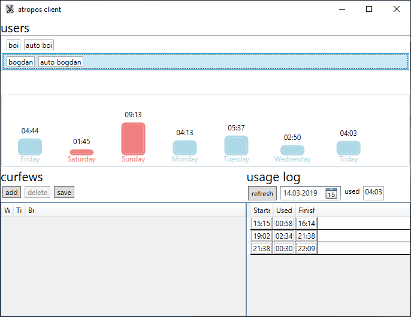

This should be set of tools to watch for users curfew. 

It has been developed since Windows 10 allows to manage curfew for Microsoft based accounts only. However I do not suppose that my children have to have MS account to use home computer. But I'd like to restrict their computer usage that is why I've used Windows 8 curfew. 

The problem is that this functionality has gone for local accounts in Windows 10.

The idea it to manage certain local account curfew from local administrator account. 

Atropos has two major components - server and client.

### server

Atropos is a tool that counts how many time person is logged on the computer. Server is started always and watches for user logged in. It constantly updates database if computer is used.

Please note that by defailt server logs *every* user time consumption even if it was not configured to be restricted with curfew.

It was built using packages below
* LibLog to add logging framework abstraction
* ling2db to store data in the Sqlite database
* NLog to log data. However it can be changed to any of logging package that is supported by LibLog 
* nlog.IndentException to adjust exceptions format
* StructureMap as DI container
* Topshelf to run as Windows service

service version is ready. It can read db parameterization and lock current user session if curfew is exceeded. 

#### installation
You have to 
* [install service](https://topshelf.readthedocs.io/en/latest/overview/commandline.html#topshelf-command-line-reference) by running `atropos.server install --localsystem` from command line using elevated command prompt (Run As Administrator). This will install service that is started using built-in LocalSystem Windows account.
* start service. If service is started first time and there is no database created it creates empty database named `AtroposData.sqlite`

client executable has to be placed somewhere on the computer. When started it will show icon in the system tray area.

#### configuration

Any SQLite tool can be used to adjust database configuration, like `DBBrowser for SQLite` e.g.

* login with each user that is going to be controlled or create users manually in the `User` data table. `Login` has to the same as it is set in Windows and `Name` can be any value.
* manually insert `Curfew` records to the database. `Time` is a time allowed to use the computer, in seconds. `WeekDay` column value is paraterized using number of the day (starting from Sunday = 0). It can has comma and dash separators additionally. `1` is a Monday, `1-5` is since **Mo** till **Fr**, `6,0` is **Sa** and **Su**. Use `0-6` for the whole week. Comma and dash can be used at the same time, like `1-3,5-6`

It is ready and will lock user screen each 30 seconds if user has exceeded allowed time. I'm going to implement option to shutdown Windows if time was exceeded. 

### client

This is small application that shows registred users that can be restricted with curfew. Read only.

 

